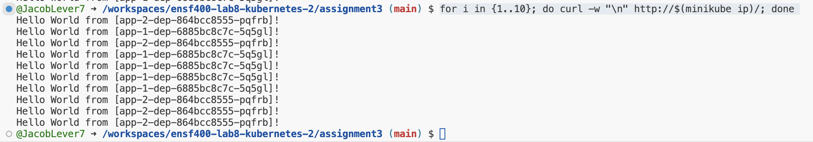
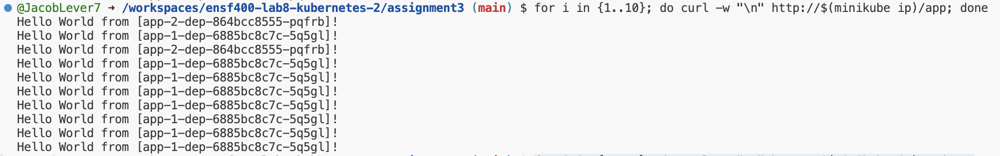

# ENSF 400 - Assignment 3 - Kubernetes
Author: Jacob Lever 
UCID: 30147405 
Date Completed: April 6th, 2024 

## Instructions - How to run
- minikube start

- minikube addons enable ingress

- kubectl apply -f nginx-configmap.yaml

- kubectl apply -f nginx-dep.yaml

- kubectl apply -f nginx-svc.yaml

- kubectl apply -f nginx-ingress.yaml

- kubectl apply -f app-1-dep.yaml

- kubectl apply -f app-1-svc.yaml

- kubectl apply -f app-1-ingress.yaml

- kubectl apply -f app-2-dep.yaml

- kubectl apply -f app-2-svc.yaml

- kubectl apply -f app-2-ingress.yaml

## Test Functionality
<b>To test the NGINX service:</b>
- curl http://$(minikube ip)/ 
^^run multiple times

or run this...
- for i in {1..10}; do curl -w "\n" http://$(minikube ip)/; done 
^^ will automatically run the curl command 10 times

Output:

<b>To test the Canary Deployment:</b>
- curl http://$(minikube ip)/app 
^^run multiple times

or run this...
- for i in {1..10}; do curl -w "\n" http://$(minikube ip)/app; done 
^^ will automatically run the curl command 10 times

Output:

